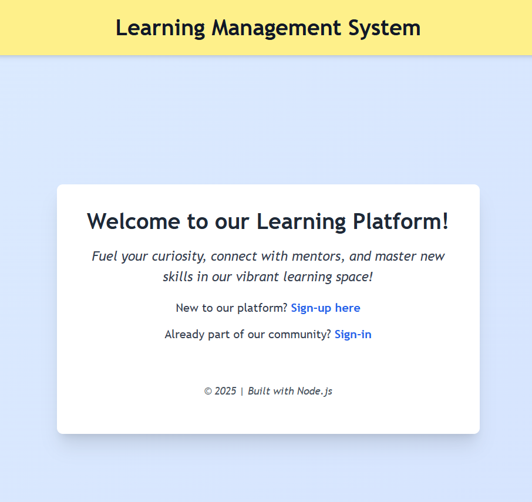
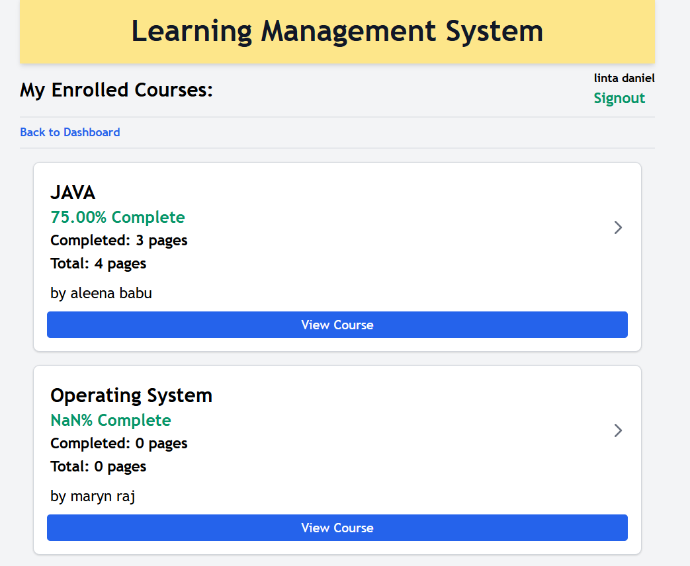
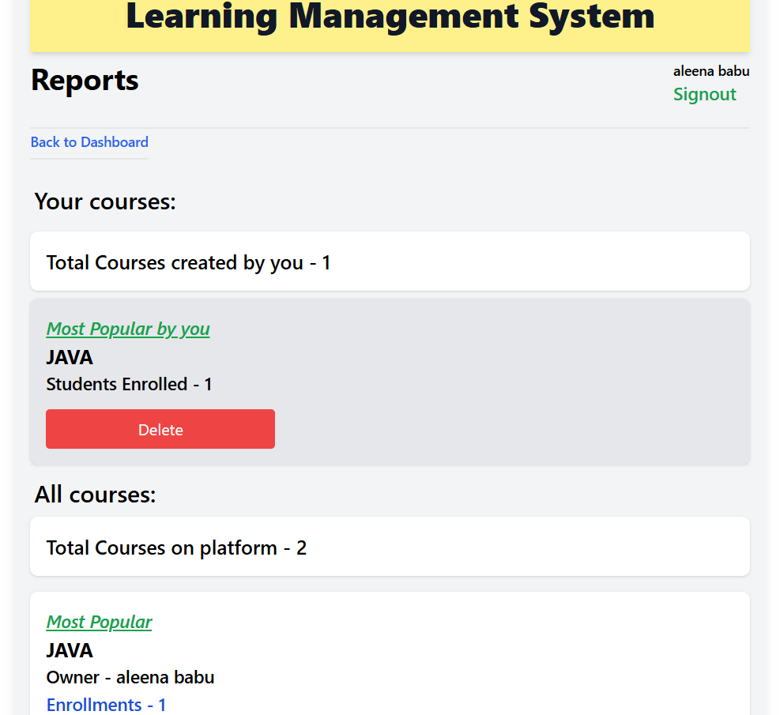

# 📚 Learning Management System (LMS)

This is a full-featured **Learning Management System** built using **Node.js, Express, EJS, PostgreSQL, and Sequelize**.

It provides an interactive platform for **teachers** to create and manage courses, chapters, and lesson content (pages), and for **students** to enroll, track their progress, and learn efficiently.

---

## ✨ Key Features

### 👨‍🏫 Teacher Accounts
- Sign up and manage your educator profile  
- Create courses, chapters, and pages with rich content  
- Monitor student enrollment and completion reports  

### 👩‍🎓 Student Accounts
- Explore all available courses  
- Enroll in courses of interest  
- View and complete chapter pages step-by-step  
- Track course completion progress with percentage indicators  

### 🔐 Authentication & Role-based Access
- Secure login and signup system  
- Role-based redirection and dashboards (teacher vs. student)  
- Password reset and change support  

### 📊 Progress Tracking
- Enrollments and completions tracked per page, chapter, and course  
- Teachers can access a performance report of enrolled students  

### 🛡️ Security
- CSRF protection  
- Input validation and form sanitation  
- Access restriction for unauthorized users  

---


## 🖼️ Screenshots

### 🏠 Homepage


### 🎓 Student Dashboard


### 📚 Enrolled Courses


### 📊 Reports View


### 👨‍🏫 Teacher Dashboard


---

## ▶️ Video Screencast

📽️ Watch a walkthrough of the LMS platform here:  
👉 https://www.loom.com/share/3d3457b9452f4b78a329e3bdd5960b1e?sid=e58fe863-57ee-4efb-85ad-d8a0003760de

---

## 🚀 Tech Stack

- **Backend:** Node.js, Express.js  
- **Frontend:** EJS, TailwindCSS  
- **Database:** PostgreSQL (with Sequelize ORM)  
- **Testing:** Jest, Supertest  
- **Deployment:** Render / Railway / Heroku  

---

## 🛠️ Setup Instructions

```bash
git clone https://github.com/Lintaaa-25/wd201-Capstone.git
cd wd201-Capstone
npm install
npx sequelize db:migrate
npm start
