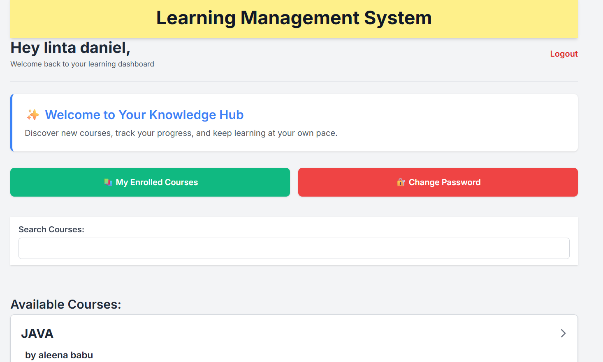
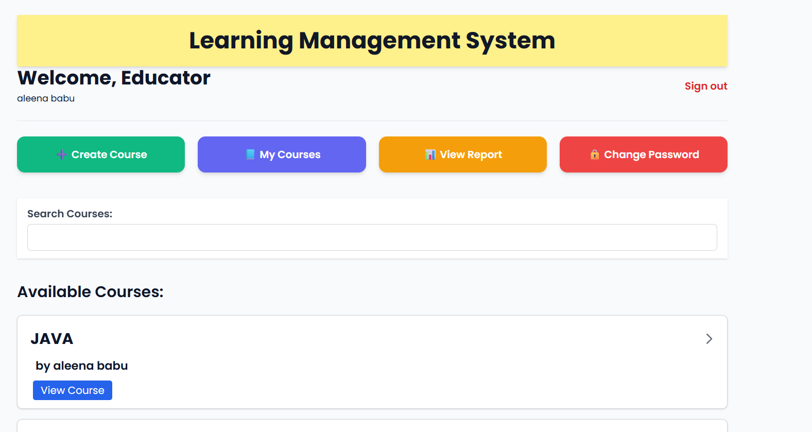

# 📚 Learning Management System (LMS)

This is a full-featured **Learning Management System** built using **Node.js, Express, EJS, PostgreSQL, and Sequelize**.

It provides an interactive platform for **teachers** to create and manage courses, chapters, and lesson content (pages), and for **students** to enroll, track their progress, and learn efficiently.

---

## ✨ Key Features

### 👨‍🏫 Teacher Accounts
- Sign up and manage your educator profile  
- Create courses, chapters, and pages with rich content  
- Monitor student enrollment and completion reports  

### 👩‍🎓 Student Accounts
- Explore all available courses  
- Enroll in courses of interest  
- View and complete chapter pages step-by-step  
- Track course completion progress with percentage indicators  

### 🔐 Authentication & Role-based Access
- Secure login and signup system  
- Role-based redirection and dashboards (teacher vs. student)  
- Password reset and change support  

### 📊 Progress Tracking
- Enrollments and completions tracked per page, chapter, and course  
- Teachers can access a performance report of enrolled students  

### 🛡️ Security
- CSRF protection  
- Input validation and form sanitation  
- Access restriction for unauthorized users  

---

## 🔗 Live Demo

🌍 [https://your-lms-app.render.com](https://your-lms-app.render.com)  
> _Replace this with your actual deployed URL._

---

## 🖼️ Screenshots

> Add screenshots to the `screenshots/` folder in your repo and link them below.

### 🎓 Student Dashboard


### 📖 Course View with Chapters


### 👨‍🏫 Teacher Dashboard


### ➕ Create Course


---

## ▶️ Video Screencast

📽️ Watch a walkthrough of the LMS platform here:  
👉 [Watch on YouTube](https://www.youtube.com/watch?v=your-video-id)  
> _Replace with actual video link (YouTube, Loom, Vimeo, etc.)_

---

## 🚀 Tech Stack

- **Backend:** Node.js, Express.js  
- **Frontend:** EJS, TailwindCSS  
- **Database:** PostgreSQL (with Sequelize ORM)  
- **Testing:** Jest, Supertest  
- **Deployment:** Render / Railway / Heroku  

---

## 🛠️ Setup Instructions

```bash
git clone https://github.com/yourusername/lms-project.git
cd lms-project
npm install
npx sequelize db:migrate
npm start
